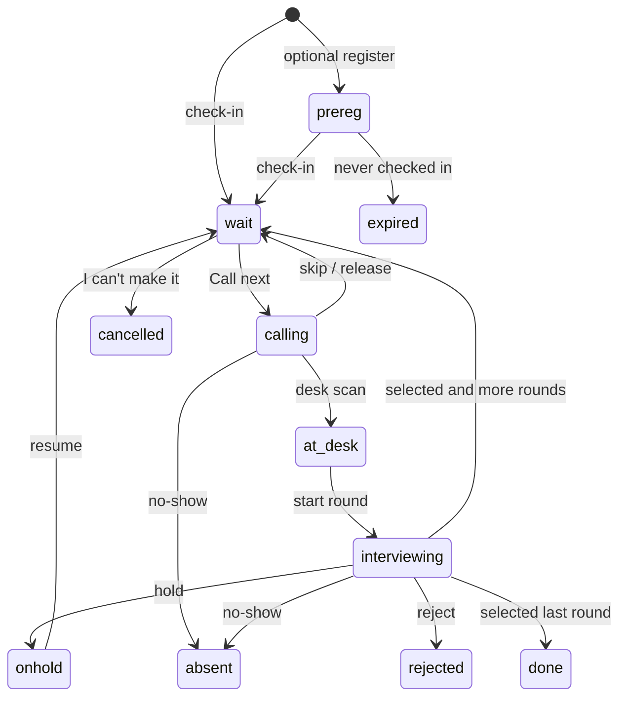

# Recruiter flow

Stored states keep the names the rest of TokenHire already uses. The product names from the recruiter brief map as follows.

## Stored names

| Brief | Stored |
| --- | --- |
| checked_in / waiting | `wait` |
| called | `calling` |
| at_desk | `at_desk` |
| in_round | `interviewing` |
| on_hold | `onhold` |
| no_show | `absent` |
| done | `done` |
| cancelled | `cancelled` |
| expired | `expired` |

## Rules

1. Call next takes the oldest `wait` token for that room's round (checked-in first), skipping anyone already `calling`, `at_desk`, `interviewing`, `done`, `cancelled`, or decided.
2. Two Call next requests on the same drive are serialised on the server (`POST /api/queue/:driveId`). The second recruiter gets the next free token or a busy-room error.
3. A token left in `calling` past the drive's timeout (default 5 minutes) can be called again, skipped, or marked no-show. It is not auto-expired.
4. Calling a token that is already `calling` is a no-op with "Already called by {{recruiter}}".
5. Desk PIN may scan and issue passes only. Decisions and export stay with recruiters and the owner.
6. A busy room cannot take another token until the current one is decided or released.
7. A candidate in Room A cannot be decided from Room B.
8. Selected on a non-final round returns to `wait` for the next round. Selected on the last round becomes `done`.
9. The same round cannot take two decisions. Undo is 8 seconds from the toast, or later by the drive owner (audit log).
10. Lobby display shows token number and first name + last initial only. Never a phone number.
11. Wrap-up warns about people still waiting, called, or in a room, and can bulk-close them as not seen / no-show / undecided. After wrap-up, check-in is closed.
12. Export (CSV and Excel) includes token, name, phone, email, role, check-in time IST, check-in method, location verified, pre-registered, each round's decision, recruiter, note, timestamps, final status and resume link. Formula-like cells are prefixed.

Machine: `src/lib/queue-machine.js`. HTTP: `POST /api/queue/:driveId` (per-drive lock). Simulation: `node scripts/simulate-drive.js`.
